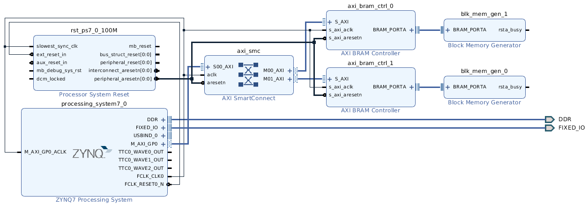

# Vivado Bitstream Modify

This repo has a design to test bitstream modification to insert data from an .elf file into BRAMs.

# The Example Block Design

This design uses the Zynq connected to two independent memory banks, called
*blk_mem_gen_0* and *blk_mem_gen_1*, both configured with single port, 
32bits data width, and 8192 addr depth. 



When executing the TCL command in the Vivado terminal

```
$ get_cells -hier -filter {PRIMITIVE_TYPE =~ BMEM.*.*}
```

The output is 

   - design_1_i/blk_mem_gen_0/U0/inst_blk_mem_gen/gnbram.gnative_mem_map_bmg.native_mem_map_blk_mem_gen/valid.cstr/ramloop[0].ram.r/prim_noinit.ram/DEVICE_7SERIES.WITH_BMM_INFO.SP.SIMPLE_PRIM36.SP_NO_ECC_ATTR.ram
   - design_1_i/blk_mem_gen_0/U0/inst_blk_mem_gen/gnbram.gnative_mem_map_bmg.native_mem_map_blk_mem_gen/valid.cstr/ramloop[1].ram.r/prim_noinit.ram/DEVICE_7SERIES.WITH_BMM_INFO.SP.SIMPLE_PRIM36.SP_NO_ECC_ATTR.ram
   - design_1_i/blk_mem_gen_1/U0/inst_blk_mem_gen/gnbram.gnative_mem_map_bmg.native_mem_map_blk_mem_gen/valid.cstr/ramloop[0].ram.r/prim_noinit.ram/DEVICE_7SERIES.WITH_BMM_INFO.SP.SIMPLE_PRIM36.SP_NO_ECC_ATTR.ram
   - design_1_i/blk_mem_gen_1/U0/inst_blk_mem_gen/gnbram.gnative_mem_map_bmg.native_mem_map_blk_mem_gen/valid.cstr/ramloop[1].ram.r/prim_noinit.ram/DEVICE_7SERIES.WITH_BMM_INFO.SP.SIMPLE_PRIM36.SP_NO_ECC_ATTR.ram

representing the BRAMs in the design. The 1st two cell belongs to the memory block blk_mem_gen_0 while the last two are from block blk_mem_gen_1.


# The BMM Extraction

The extract_bmm.tcl opens the synthesized design, finds the existing BRAMs,
and map them into the memory blocks *blk_mem_gen_0* and *blk_mem_gen_1*.

The resulting BMM file is like this

```
ADDRESS_SPACE memory_0 COMBINED [0x00000000:0x000001FFF]
ADDRESS_RANGE RAMB32
   BUS_BLOCK
      bit_modif_i/blk_mem_gen_0/U0/inst_blk_mem_gen/gnbram.gnative_mem_map_bmg.native_mem_map_blk_mem_gen/valid.cstr/ramloop[0].ram.r/prim_noinit.ram/DEVICE_7SERIES.WITH_BMM_INFO.SP.SIMPLE_PRIM36.SP_NO_ECC_ATTR.ram [0] [15:0] LOC=X3Y20;
      bit_modif_i/blk_mem_gen_0/U0/inst_blk_mem_gen/gnbram.gnative_mem_map_bmg.native_mem_map_blk_mem_gen/valid.cstr/ramloop[1].ram.r/prim_noinit.ram/DEVICE_7SERIES.WITH_BMM_INFO.SP.SIMPLE_PRIM36.SP_NO_ECC_ATTR.ram [1] [31:16] LOC=X3Y19;
   END_BUS_BLOCK;
END_ADDRESS_RANGE;
END_ADDRESS_SPACE;

ADDRESS_SPACE memory_1 COMBINED [0x00000000:0x000001FFF]
ADDRESS_RANGE RAMB32
   BUS_BLOCK
      bit_modif_i/blk_mem_gen_1/U0/inst_blk_mem_gen/gnbram.gnative_mem_map_bmg.native_mem_map_blk_mem_gen/valid.cstr/ramloop[0].ram.r/prim_noinit.ram/DEVICE_7SERIES.WITH_BMM_INFO.SP.SIMPLE_PRIM36.SP_NO_ECC_ATTR.ram [0] [15:0] LOC=X3Y22;
      bit_modif_i/blk_mem_gen_1/U0/inst_blk_mem_gen/gnbram.gnative_mem_map_bmg.native_mem_map_blk_mem_gen/valid.cstr/ramloop[1].ram.r/prim_noinit.ram/DEVICE_7SERIES.WITH_BMM_INFO.SP.SIMPLE_PRIM36.SP_NO_ECC_ATTR.ram [1] [31:16] LOC=X3Y21;
   END_BUS_BLOCK;
END_ADDRESS_RANGE;
```

By the end of the TCL script, *data2mem* is executed in the Linux terminal to insert the elf file into the bitstream *new.bit*.

```
$ data2mem -bm mem_dump.bmm -bd ./src/processor-based/image.elf -bt ./vivado/bit_modif/bit_modif.runs/impl_1/bit_modif_wrapper.bit -o b new.bit
```

To check whether the new bitstream is updated, it is possible to dump the BRAM's content with
the following command in the Linux terminal:

```
$ data2mem -bm mem_dump.bmm -bt new.bit -d > dump.txt
```

Then open the dump.txt and search for *bit_modif_i* to find the written BRAMs.


# How to run it

These scripts are assuming Linux operation system (Ubuntu 18.04) and Vivado 2018.2.

Follow these instructions to recreate the Vivado and SDK projects:
 - Open the **build.sh** script and edit the first lines to setup these environment variables:
    - **VIVADO**: path to the Vivado install dir;
    - **VIVADO_DESIGN_NAME**: mandatory name of the design;
    - **XIL_APP_NAME**: used only in projects with software;
    - **VIVADO_TOP_NAME**: set the top name (optional).  
 - run *build.sh*

These scripts will recreate the entire Vivado project, compile the design, generate the bitstream, update the bitstream with the elf file, export the hardware to SDK, create the SDK projects, import the source files, build all projects, and finally download both the bitstream and the elf application. Hopefully, all these steps will be executed automatically.

# How to update the scripts

These scripts come from a template repository and they get updated and improved over time. If you wish to get the latest script version, then follow these steps:

```
git remote add template https://github.com/amamory/vivado-base-project.git
git fetch --all
git merge --no-commit --no-ff template/master --allow-unrelated-histories
```

Solve any conflict manually and then commit.

# Future work

 - use also [updatemem](https://www.xilinx.com/support/answers/63041.html)
 
# How to Use Vivado

[Vipin Kizheppatt](https://www.youtube.com/watch?v=ahws--oNpBc&list=PLXHMvqUANAFOviU0J8HSp0E91lLJInzX1) provides a great set of more than 70 extremely didatic videos. As a personal experience, I would strongly suggest that as a starting point.

# Credits

The scripts are based on the excellent scripts from [fpgadesigner](https://github.com/fpgadeveloper/zedboard-axi-dma) plus few increments from my own such as project generalization, support to SDK project creation and compilation and other minor improvements. 
